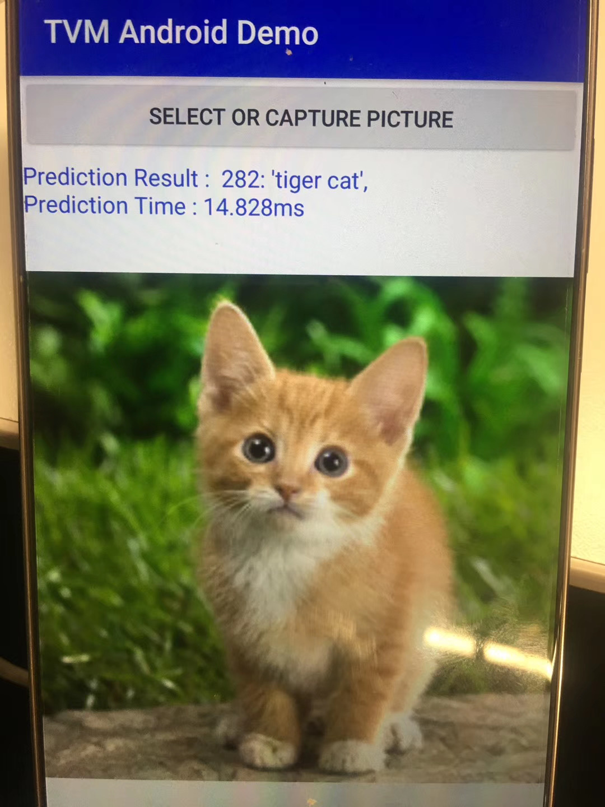

#tvm Android mobilenet2
先看下效果,还是非常不错的
##

变更项:
预处理耗时测试
相比官方代码通过adb install apk,通过AS来安装更简单

##build arm lib
###require
####生成设备专用的toolchain
    你可以单独使用 Android NDK 附带的工具链，也可以将其作为插件与现有 IDE 结合使用。如果已拥有自己的编译系统，只需要能够调用交叉编译器以便为其增加对 Android 的支持。
    在 ${NDKROOT}/build/tools 下有两个脚本：make_standalone_toolchain.py 和 make-standalone-toolchain.sh。
    执行以下命令便可生成交叉编译工具：
    ./make_standalone_toolchain.py --arch=arm64 --api=24 --install-dir=/opt/ndk-tool
    这里不要把install dir 放在tmp目录下，这样一旦机器重启便会失效。
    --arch    {arm,arm64,mips,mips64,x86,x86_64}
    -api API   Target the given API version (example: "--api 24"). 


####配置toolchainer
    1、adb shell                    (linux进入翻译机。)
    2、cat  /proc/cpuinfo            (查看翻译机型号) 
    利用toolchain生成安卓机下能运行的模型参数文件。
    只列出关键步骤，其他步骤与linux环境下无异：
    修改target:
    arch = "arm64"
    target = "llvm -target=%s-linux-android" % arch
    修改lib的输出方式：
    lib.export_library("mobile.so", ndk.create_shared)
    添加TVM_NDK_CC环境变量(或者直接写在代码中)
    export TVM_NDK_CC=/opt/ndk/bin/aarch64-linux-android-ld
    
##build arm lib
由于在tophub中有对应的log,所以直接build
参考tutorials/frontend/deploy_model_on_android.py

target = 'llvm -target=arm64-linux-android -mattr=+neon'
os.environ['TVM_NDK_CC'] = "/home/naruto/test_toolchain/android-toolchain-arm64/bin/aarch64-linux-android-g++"
然后拷贝到AS工程
```
    private static final int MODEL_INPUT_SIZE       = 112;
    private static final String MODEL_CL_LIB_FILE   = "";
    private static final String MODEL_CPU_LIB_FILE  = "file:///android_asset/deploy_lib_cpu.so";
    private static final String MODEL_GRAPH_FILE    = "file:///android_asset/deploy_graph.json";
    private static final String MODEL_PARAM_FILE    = "file:///android_asset/deploy_param.params";
    private static final String MODEL_LABEL_FILE    = "file:///android_asset/imagenet.shortnames.list";
```


##注意事项及好的命令
    autotvm容易出现pending几百,反正就是跑不下去了,没有具体深究
    gradle build时一定要在网络非常好的情况下build,否则会非常慢,以及要添加ali的源,你懂的,具体参考工程具体设置
    RPC链接是通过USB的,需要做端口转发
    手机保持唤醒
    好用的命令
    adb shell getprop ro.product.cpu.abi
    arm64-v8a
    netstat -a
    adb logcat *:e：查看日志中所有Error的日志信息
    adb forward --list
    adb forward --remove-all

###RPC链接
    这是在论坛找到的方案
    usb 链接默认是5001端口，然后启动tracker,server （ip，端口）,最后端口转发，adb 在platform-tools/adb，环境变量已经设置
    adb forward tcp:5001 tcp:5001
    adb reverse tcp:9191 tcp:9191
    python3 -m tvm.exec.rpc_tracker --host=0.0.0.0 --port=9191　启动时端口可能变
    watch -n 0.1 python3 -m tvm.exec.query_rpc_tracker --host=0.0.0.0 --port=9191
    ps -ef| grep rpc | awk '{print $2}' | xargs -i kill -9 {}


